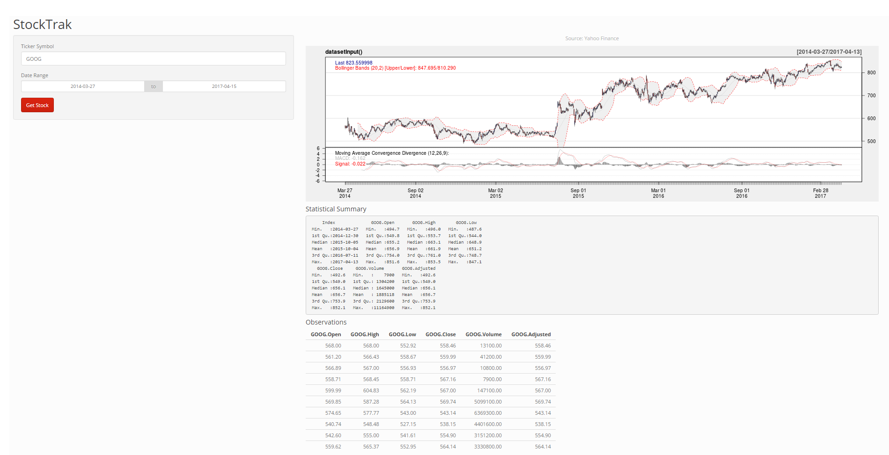

StockTrak Shiny App
========================================================
author: Stephanie Stallworth
date: April 14, 2017
autosize: true

Overview
========================================================

**StockTrak** is an easy-to-use Shiny app that tracks stock prices for a selected time period based on data from Yahoo! Finance.   

App features include:  

- a graphical view of stock performance 
- summary statistics  
- top 10 observations 


User Guide
=======================================================
With StockTrak, stock data is just a few mouse clicks away!


1. **Simply access app:** https://stephaniestallworth.shinyapps.io/StockTrak/


2. **Input the following in the appropriate boxes:**     
      - stock symbol (ex: GOOG, AAPL)    
      - date range in appropriate boxes   
      
   
3. **Click "Get Stock" to see results**  

**Note**: Remember to select "Get Stock" when changing dates or stock selection to view new results.

StockTrak Interface
========================================================


ui.R Code
========================================================


```r
library(shiny)
library(shinythemes)

shinyUI(fluidPage(theme =shinytheme("simplex"),
        headerPanel("StockTrak"),
        sidebarPanel(
                textInput("symb", "Ticker Symbol", "GOOG"),
                dateRangeInput("dates", 
                               "Date Range",
                               start = "2014-03-27", 
                               end = as.character(Sys.Date())),
                                helpText("Input stock symbol (example: GOOG, AAPL, SBUX) and dates to see stock performance over time"),
                        submitButton('Get Stock')),
        mainPanel(
                plotOutput('newHist'),
                h4("Statistical Summary"),
                verbatimTextOutput("summary"),
                
                h4("Observations"),
                tableOutput("view")
        )
        ))
```

sever.R Code
========================================================


```r
library(quantmod)
library(shiny)

shinyServer(
        function(input, output) {
                datasetInput <- reactive({
                        getSymbols(input$symb, src = "google", 
                                   from = input$dates[1],
                                   to = input$dates[2],
                                   auto.assign = FALSE)
                })
                output$newHist <- renderPlot({
                        candleChart(datasetInput(),
                                    theme=chartTheme('white',up.col='dark blue',dn.col='red'),TA=c(addBBands()))
                        addMACD() 
                })
                # Generate a summary of the dataset
                output$summary <- renderPrint({
                        dataset <- datasetInput()
                        summary(dataset)
                }) 
                # Show the first "n" observations
                output$view <- renderTable({
                        head(datasetInput(), n = 10)
                })
        })
```

Future Development
=====================================================
StockTrak allows users to easily see the performance of their favorite stock over a desired time, and this is only the beginning.

Possible features to implement in later releases:    
- Select and compare multiple stocks  
- Showing an overall market trend for chosen time period   

**...Stay tuned!**
Thank You
===========
